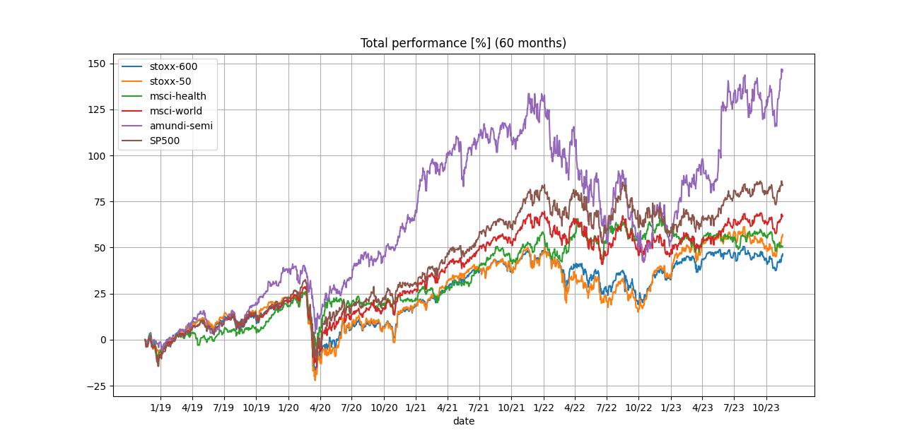

# Observations on different techniques

## Pearson vs Kendall Correlation
From the https://www.phdata.io/blog/data-science-stats-review/, Pearson's correlation (the most common) shows a linear relationship between variables, while Kendall's correlation measures a monotonic relationship. The difference here is:
 - lienar relationship - when two variables move in the same direction AND at the same rate
 - monotonic relationship - when two variables move in the same direction, BUT not necessarily with the same rate

Also, the variables used with Pearson's correlation shall fullfill several assumptions, including a normal distribution (i.e. the bell curve). From the experiments, the feeling is a bit different:
Experiments were done on pct_change computed from either non-filtered data or filtered with exponential moving average (EMA) of window (span) 14 days.
I would expect that the "lack of linearity" of Kendall would show higher numbers for data which change in similar ways, but with a different (local) trend. Therefore, I would expect very high values for pairs such as S&P500 - MSCI world or Stoxx-50 and Stoxx-600. These were indeed showing the highest correlation coefficients, but they were around 0.85.
When using the Pearson's correlation, the same pairs were showing correlation >= 0.95. These numbers correspond more to what I see in the graphs - if the variables in the pair are visibly co similar to each other, correlation of 0.95 feels much more right than 0.85. I mean, how similar would they have to be, so they would have > 0.9 with the Kendall's method?
The values in Kendall generally are lower than with Pearson's, which also bugs me - they might give one a feeling that the data are "less similar" to each other than they really are...

**CONCLUSION: From this, I would go for Pearson's correlation.**

## Impact of filtering
I used Exponential Moving Average,which seems to be just exponential filtering, but allowing to specify a window width: https://pandas.pydata.org/docs/reference/api/pandas.DataFrame.ewm.html
The window was set to 14 days for the following experiments.

Here's the correlation Pearson's matrix again:

The correlation done on the filtered data is on the left, the unfiltered is on the right.
Here are the (absolute) differences between the two heatmaps:

We can see that the correlation values we got from the filtered data have grown - I would say that's probably correct, as we filtered out the small daily movements which may have been causing errors in correlation in the unfiltered case.

We can also see that the differences between the correlation coefficients from filtered and unfiltered data are very small for the maximal values and also relativelly small for the smallest correlation value (amundi-semi vs msci-health). They are the largest for the left bottom part of the heatmap, in the stoxx-600 and stoxx-50 columns. Also, even though the correlation between the two is very high, the correlation of e.g. stoxx-50 to msci-health and stoxx-600 to msci-health are quite different - if you see the filtered data series, they are very similar to each other, but also have enough differences which may be causing such differences.

When it comes to the rows, it's better visible in the heatmap for the filtered data that msci-world and S&P500 tend to show higher correlations with others than the rest.